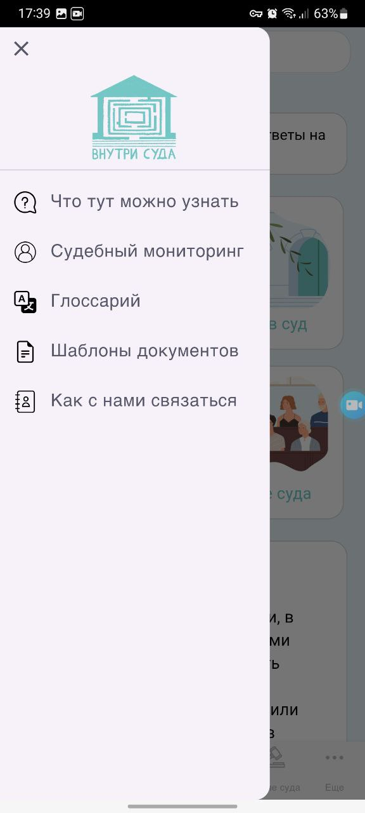
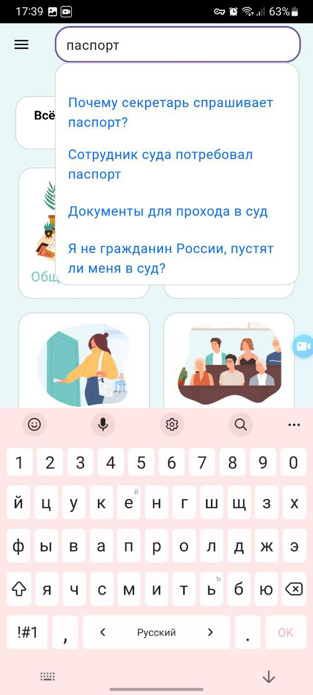
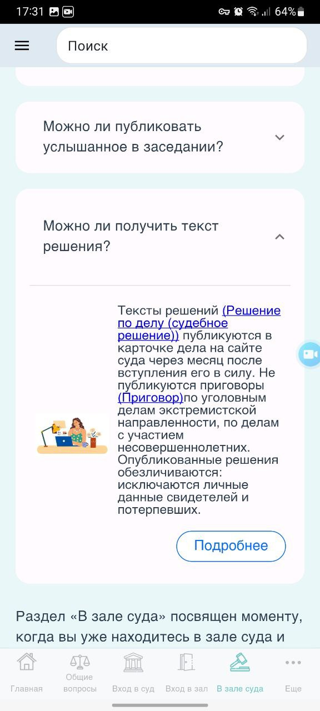
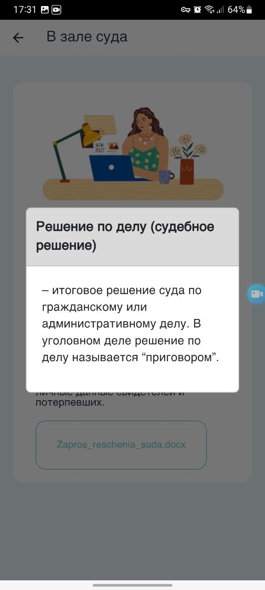

# Внутри суда
Мобильное гайд-приложение отвечает на популярные вопросы о том, с чем может столкнуться рядовой посетитель суда. Содержит глоссарий, доступно поясняющий термины судебной системы. Поиск позволяет пользователям быстро находить нужную информацию в приложении. 

    
    
    

    
    
    

## Описание:
В приложении реализованы
- многостраничный интерфейс, исходя из прототипа веб-приложения;
- механизм открытия внешних приложений и сервисов (url_launcher);
- свободный зум для изображений (photo_view);
- навигация, включая Drawer и BottomNavigationBar;
- функционал поиска по приложению;
- адаптивная верстка.

## Платформа:

Android

## Скринкаст:

Ссылка на скринкат | Описание
--- | ---
https://youtube.com/shorts/U5XuFJJ6lCg?si=p6DhOPOd7vyLMbvt | многостраничный интерфейс
https://youtube.com/shorts/HJTCsqfMjB0?si=3vM4itYKSAGttUtw | поиск по приложению
https://youtube.com/shorts/6Q56Qrl7CjY?si=m3r0OsHGfuE6DUZk | переход по внешним ссылкам
https://youtube.com/shorts/azSA7qVB5Fw?si=0VILRo4pkm4wXbkd | свободный зум изображений 
